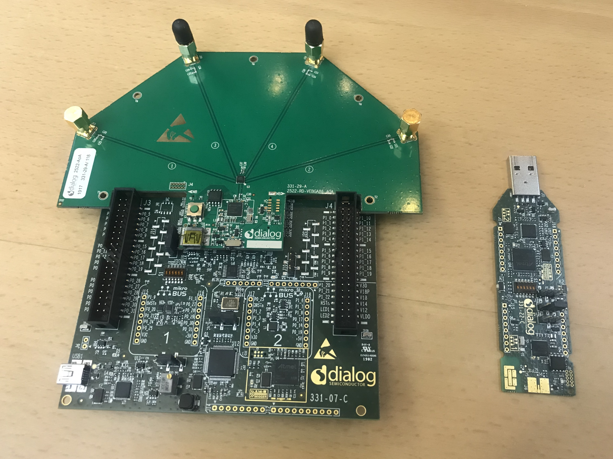
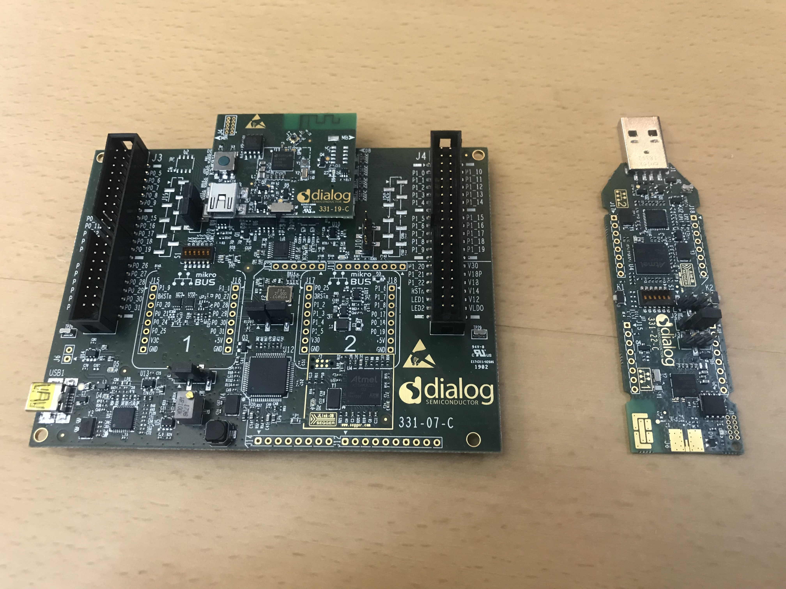

# Orthrus
Bluetooth direction finding tools

## Summary
This repo contains python tools for interacting with the dialog semiconductior Angle-of-Arrival(AoA) and Time-of-Flight(ToF) development kits based on the DA1469x chipset.

## Requirements
- AoA development kit. The kit contains a receiver board(DA1469x AoA antenna board + daughter board) and a transmitter USB dongle board

- ToF development kit. The kit contains a receiver board(DA1469x board + daughter board) and a transmitter USB dongle board

- python3
- pip3

## Installation
1. Download zip or clone repo to your machine
2. Run `which python3`, if a path to `python3` is returned, move on to step 4
3. Run `brew install python3`
4. From the project root directory, run `pip3 -r requirements.txt` to install required python packages

## Run AoA Demo
1. Connect AoA receiver board to your machine to establish serial communication
2. Connect the AoA transmitter dongle to your machine or any other USB host
3. Run `aoa.py -v`. You should see angle data being printed to the standard output

Note: It's important that the AoA transmitter USB dongle is connected to a USB host and not just a USB power supply

## Run ToF Demo
1. Connect ToF receiver board to your machine to establish serial communication
2. Connect the ToF transmitter dongle to your machine or any other USB host
3. Run `tof.py -v`. You should see the distance between Tx and Rx being printed to the standard output

Note: It's important that the ToF transmitter USB dongle is connected to a USB host and not just a USB power supply

